混学时选手，正好800分
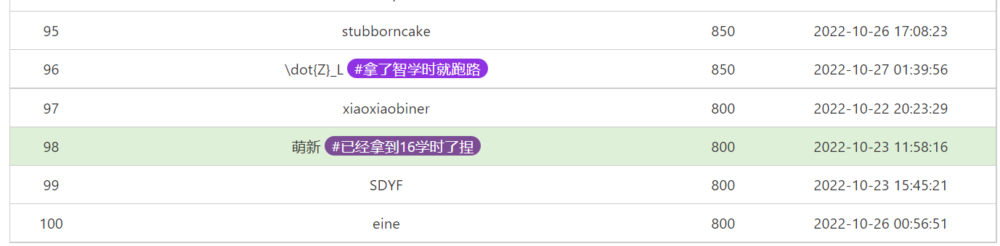

## 0x1 签到
`flag{HappyHacking2022-f6dd1b7707}`
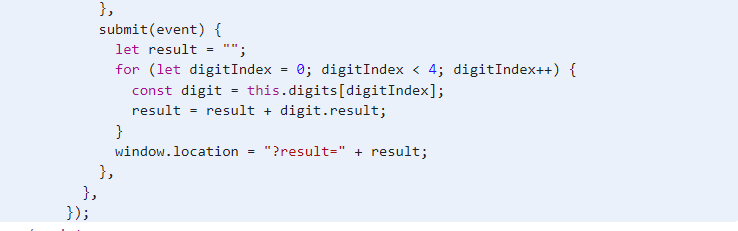
构造请求`?result=2022`即可

## 0x2 猫咪问答 一半的题目喵
`flag{meowexammeow_772b498346fe0925_b3dbc4b30e}`
第一题因为是队内选手所以知道2017年，然后枚举月份即可

第二题去`ftp.lug.ustc.edu.cn`找ppt
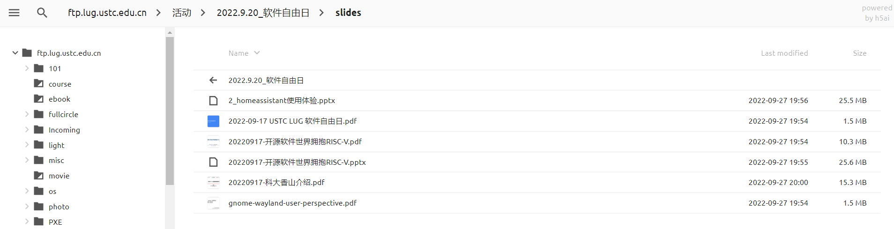

来到这一页：
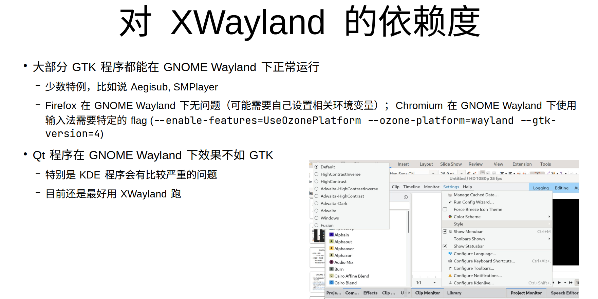
应该就是这个，图里看一下，发现1080p 25fps，又不像是播放器，马上想到剪辑软件

百度得到：


第三题


## 0x3 家目录里的秘密 VSCode里的flag
`flag{finding_everything_through_vscode_config_file_932rjdakd}`
容易找到
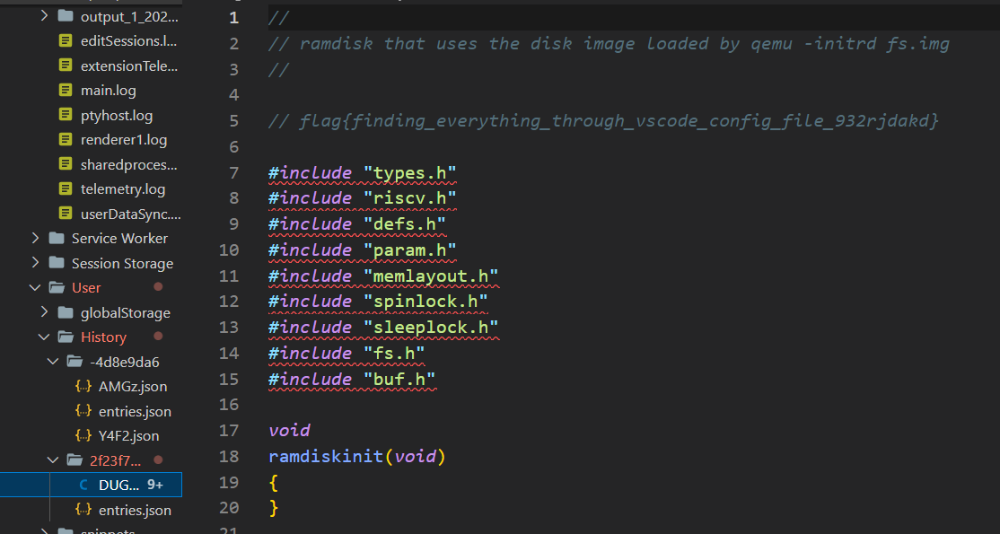

## 0x4 HeiLang
`flag{6d9ad6e9a6268d96-7a5dfd7e75222d83}`
做这个替换
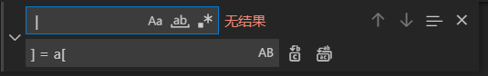

赋值全部正常了
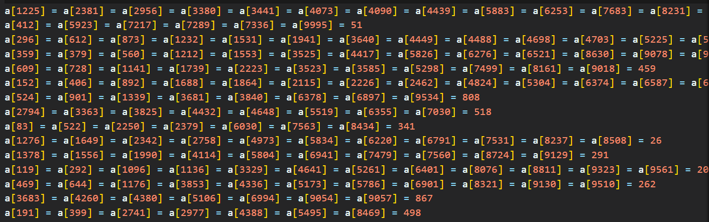

没有说何语言不正确的意思，主要是我没装heilang环境

## 0x5 旅行照片2.0 照片分析
`flag{1f_y0u_d0NT_w4nt_shOw_theSe_th3n_w1Pe_EXlF}`
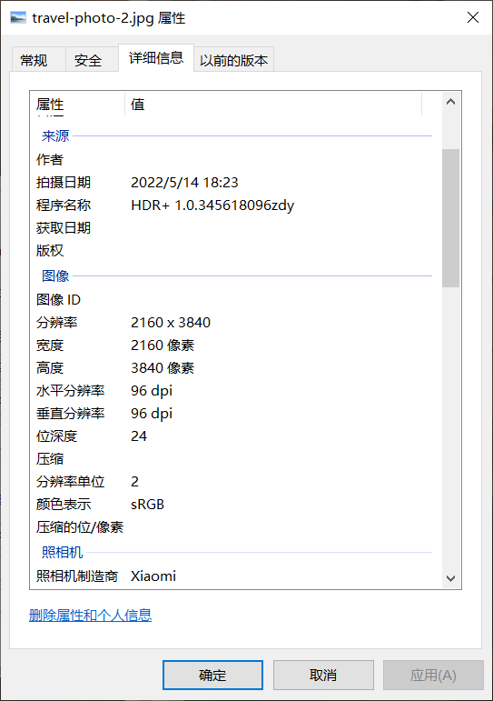
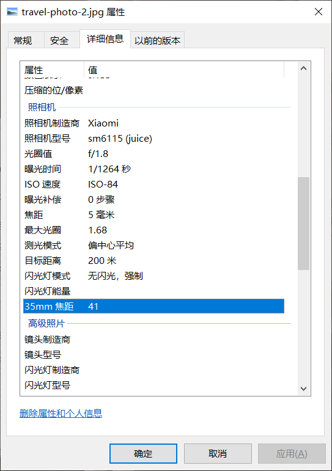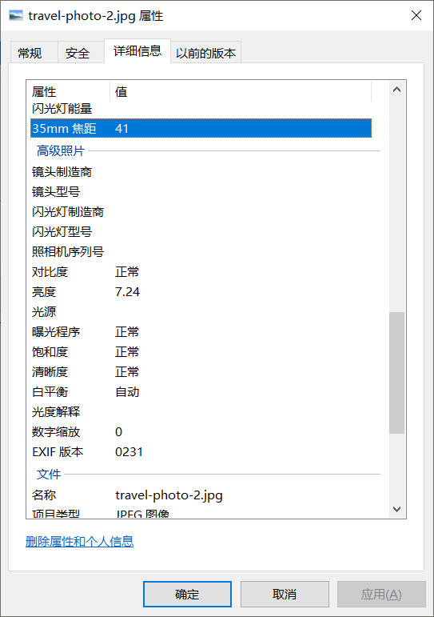

格式整理
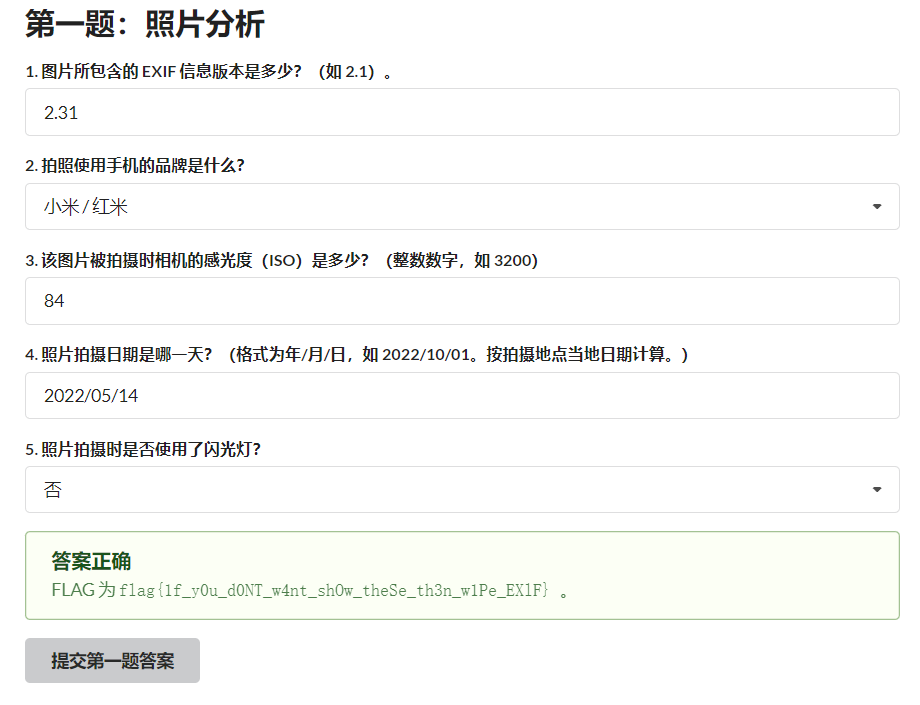

## 0x6 线路板
`flag{8_1ayER_rogeRS_81ind_V1a}`
直接打开文件看全是这种，XY很惹眼
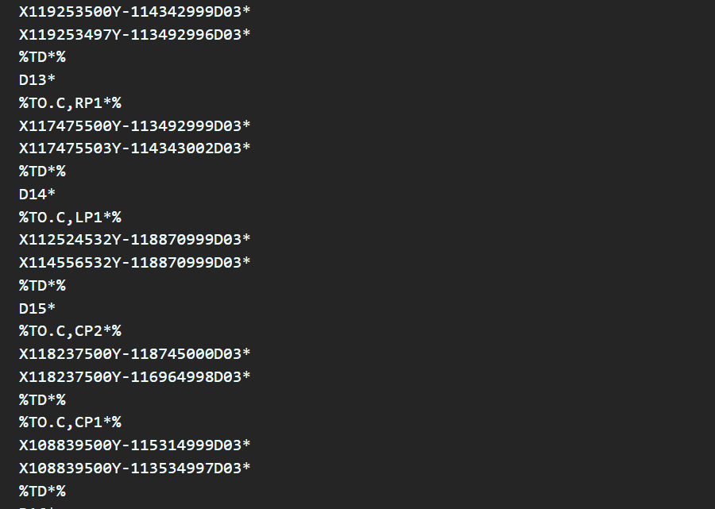

找了个软件叫GerbView，打开看
找到有flag的那张板子然后开始删文件里的东西，删到某一步就看到了
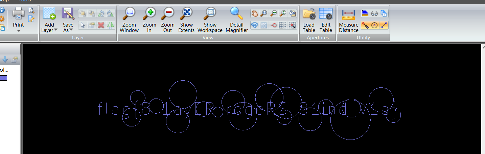

以下是剩下的
```
%TF.GenerationSoftware,KiCad,Pcbnew,(6.0.6)*%
%TF.CreationDate,2022-08-23T23:43:20+09:00*%
%TF.ProjectId,ebaz_sdr,6562617a-5f73-4647-922e-6b696361645f,rev?*%
%TF.SameCoordinates,Original*%
%TF.FileFunction,Soldermask,Top*%
%TF.FilePolarity,Negative*%
%FSLAX46Y46*%
G04 Gerber Fmt 4.6, Leading zero omitted, Abs format (unit mm)*
G04 Created by KiCad (PCBNEW (6.0.6)) date 2022-08-23 23:43:20*
%MOMM*%
%LPD*%
G01*
G04 APERTURE LIST*
G04 Aperture macros list*
%AMRoundRect*
0 Rectangle with rounded corners*
0 $1 Rounding radius*
0 $2 $3 $4 $5 $6 $7 $8 $9 X,Y pos of 4 corners*
0 Add a 4 corners polygon primitive as box body*
4,1,4,$2,$3,$4,$5,$6,$7,$8,$9,$2,$3,0*
0 Add four circle primitives for the rounded corners*
1,1,$1+$1,$2,$3*
1,1,$1+$1,$4,$5*
1,1,$1+$1,$6,$7*
1,1,$1+$1,$8,$9*
0 Add four rect primitives between the rounded corners*
20,1,$1+$1,$2,$3,$4,$5,0*
20,1,$1+$1,$4,$5,$6,$7,0*
20,1,$1+$1,$6,$7,$8,$9,0*
20,1,$1+$1,$8,$9,$2,$3,0*%
G04 Aperture macros list end*
%ADD10RoundRect,0.050800X0.300000X0.325000X-0.300000X0.325000X-0.300000X-0.325000X0.300000X-0.325000X0*%
%ADD11R,0.999998X0.550012*%
%ADD12RoundRect,0.050800X0.325000X-0.300000X0.325000X0.300000X-0.325000X0.300000X-0.325000X-0.300000X0*%
%ADD13RoundRect,0.050800X-0.325000X0.300000X-0.325000X-0.300000X0.325000X-0.300000X0.325000X0.300000X0*%
%ADD14R,0.850900X2.499360*%
%ADD15R,1.470000X1.160000*%
%ADD16RoundRect,0.160000X0.160000X-0.197500X0.160000X0.197500X-0.160000X0.197500X-0.160000X-0.197500X0*%
%ADD17R,1.700000X1.700000*%
%ADD18O,1.700000X1.700000*%
%ADD19RoundRect,0.160000X-0.160000X0.197500X-0.160000X-0.197500X0.160000X-0.197500X0.160000X0.197500X0*%
%ADD20R,1.800000X4.400000*%
%ADD21O,1.800000X4.000000*%
%ADD22O,4.000000X1.800000*%
%ADD23R,1.500000X1.500000*%
%ADD24C,1.500000*%
%ADD25R,1.350000X1.350000*%
%ADD26O,1.350000X1.350000*%
%ADD27RoundRect,0.237500X0.250000X0.237500X-0.250000X0.237500X-0.250000X-0.237500X0.250000X-0.237500X0*%
%ADD28O,0.350800X2.450800*%
%ADD29O,2.400000X4.000000*%
%ADD30O,2.000000X3.000000*%
G04 APERTURE END LIST*
D10*
%TO.C,RP3*%
X115487500Y-121664999D03*
X114637497Y-121665002D03*
%TD*%
D11*
%TO.C,UP1*%
X112016558Y-113475912D03*
X112016558Y-114425923D03*
X112016558Y-115375934D03*
X114816552Y-115375934D03*
X114816552Y-114425923D03*
X114816552Y-113475912D03*
%TD*%
D12*
%TO.C,RP2*%
X119253500Y-114342999D03*
X119253497Y-113492996D03*
%TD*%
D13*
%TO.C,RP1*%
X117475500Y-113492999D03*
X117475503Y-114343002D03*
%TD*%
D14*
%TO.C,LP1*%
X112524532Y-118870999D03*
X114556532Y-118870999D03*
%TD*%
D15*
%TO.C,CP2*%
X118237500Y-118745000D03*
X118237500Y-116964998D03*
%TD*%
%TO.C,CP1*%
X108839500Y-115314999D03*
X108839500Y-113534997D03*
%TD*%
D16*
%TO.C,R17*%
X189738000Y-122682000D03*
X189738000Y-121487000D03*
%TD*%
D17*
%TO.C,J9*%
X138433277Y-138114532D03*
D18*
X140973277Y-138114532D03*
X143513277Y-138114532D03*
X146053277Y-138114532D03*
%TD*%
D19*
%TO.C,R12*%
X189738000Y-126783500D03*
X189738000Y-127978500D03*
%TD*%
D20*
%TO.C,J7*%
X113157000Y-133258001D03*
D21*
X107357000Y-133258001D03*
D22*
X110157000Y-138058001D03*
%TD*%
D23*
%TO.C,PMODA1*%
X146638747Y-80848200D03*
D24*
X146638747Y-78308200D03*
X149178747Y-80848200D03*
X149178747Y-78308200D03*
X151718747Y-80848200D03*
X151718747Y-78308200D03*
X154258747Y-80848200D03*
X154258747Y-78308200D03*
X156798747Y-80848200D03*
X156798747Y-78308200D03*
X159338747Y-80848200D03*
X159338747Y-78308200D03*
%TD*%
D23*
%TO.C,J2J1*%
X164849277Y-89854532D03*
D24*
X164849277Y-92394532D03*
X162309277Y-89854532D03*
X162309277Y-92394532D03*
X159769277Y-89854532D03*
X159769277Y-92394532D03*
X157229277Y-89854532D03*
X157229277Y-92394532D03*
X154689277Y-89854532D03*
X154689277Y-92394532D03*
X152149277Y-89854532D03*
X152149277Y-92394532D03*
X149609277Y-89854532D03*
X149609277Y-92394532D03*
X147069277Y-89854532D03*
X147069277Y-92394532D03*
%TD*%
D16*
%TO.C,R3*%
X191338500Y-95580500D03*
X191338500Y-94385500D03*
%TD*%
%TO.C,R15*%
X183007000Y-133021000D03*
X183007000Y-131826000D03*
%TD*%
D23*
%TO.C,PMODB1*%
X169498747Y-80848200D03*
D24*
X169498747Y-78308200D03*
X172038747Y-80848200D03*
X172038747Y-78308200D03*
X174578747Y-80848200D03*
X174578747Y-78308200D03*
X177118747Y-80848200D03*
X177118747Y-78308200D03*
X179658747Y-80848200D03*
X179658747Y-78308200D03*
X182198747Y-80848200D03*
X182198747Y-78308200D03*
%TD*%
D19*
%TO.C,R14*%
X183007000Y-129069500D03*
X183007000Y-130264500D03*
%TD*%
D25*
%TO.C,J6*%
X195065000Y-137625600D03*
D26*
X197065000Y-137625600D03*
X195065000Y-135625600D03*
X197065000Y-135625600D03*
X195065000Y-133625600D03*
X197065000Y-133625600D03*
X195065000Y-131625600D03*
X197065000Y-131625600D03*
X195065000Y-129625600D03*
X197065000Y-129625600D03*
X195065000Y-127625600D03*
X197065000Y-127625600D03*
X195065000Y-125625600D03*
X197065000Y-125625600D03*
X195065000Y-123625600D03*
X197065000Y-123625600D03*
X195065000Y-121625600D03*
X197065000Y-121625600D03*
X195065000Y-119625600D03*
X197065000Y-119625600D03*
%TD*%
D23*
%TO.C,J8*%
X133353277Y-135574532D03*
D24*
X133353277Y-138114532D03*
X130813277Y-135574532D03*
X130813277Y-138114532D03*
X128273277Y-135574532D03*
X128273277Y-138114532D03*
X125733277Y-135574532D03*
X125733277Y-138114532D03*
X123193277Y-135574532D03*
X123193277Y-138114532D03*
X120653277Y-135574532D03*
X120653277Y-138114532D03*
%TD*%
D25*
%TO.C,J5*%
X195065000Y-114079800D03*
D26*
X197065000Y-114079800D03*
X195065000Y-112079800D03*
X197065000Y-112079800D03*
X195065000Y-110079800D03*
X197065000Y-110079800D03*
X195065000Y-108079800D03*
X197065000Y-108079800D03*
X195065000Y-106079800D03*
X197065000Y-106079800D03*
X195065000Y-104079800D03*
X197065000Y-104079800D03*
X195065000Y-102079800D03*
X197065000Y-102079800D03*
X195065000Y-100079800D03*
X197065000Y-100079800D03*
X195065000Y-98079800D03*
X197065000Y-98079800D03*
X195065000Y-96079800D03*
X197065000Y-96079800D03*
%TD*%
D23*
%TO.C,J1*%
X186693277Y-89854532D03*
D24*
X186693277Y-92394532D03*
X184153277Y-89854532D03*
X184153277Y-92394532D03*
X181613277Y-89854532D03*
X181613277Y-92394532D03*
X179073277Y-89854532D03*
X179073277Y-92394532D03*
X176533277Y-89854532D03*
X176533277Y-92394532D03*
X173993277Y-89854532D03*
X173993277Y-92394532D03*
X171453277Y-89854532D03*
X171453277Y-92394532D03*
X168913277Y-89854532D03*
X168913277Y-92394532D03*
%TD*%
D19*
%TO.C,R5*%
X189738000Y-98081500D03*
X189738000Y-99276500D03*
%TD*%
D27*
%TO.C,R1*%
X121054500Y-76327000D03*
X119229500Y-76327000D03*
%TD*%
D16*
%TO.C,R11*%
X186563000Y-126544000D03*
X186563000Y-125349000D03*
%TD*%
%TO.C,R4*%
X189738000Y-101764500D03*
X189738000Y-100569500D03*
%TD*%
D28*
%TO.C,HDMI2*%
X105124352Y-79527400D03*
X105624351Y-79527400D03*
X106124350Y-79527400D03*
X106624349Y-79527400D03*
X107124348Y-79527400D03*
X107624347Y-79527400D03*
X108124346Y-79527400D03*
X108624345Y-79527400D03*
X109124344Y-79527400D03*
X109624343Y-79527400D03*
X110124342Y-79527400D03*
X110624341Y-79527400D03*
X111124340Y-79527400D03*
X111624339Y-79527400D03*
X112124338Y-79527400D03*
X112624337Y-79527400D03*
X113124336Y-79527400D03*
X113624335Y-79527400D03*
X114124334Y-79527400D03*
D29*
X102424343Y-78727399D03*
X116824344Y-78727399D03*
D30*
X102424343Y-72827401D03*
X116824344Y-72827401D03*
%TD*%
D19*
%TO.C,R6*%
X189738000Y-107225500D03*
X189738000Y-108420500D03*
%TD*%
%TO.C,R10*%
X186563000Y-122809000D03*
X186563000Y-124004000D03*
%TD*%
D16*
%TO.C,R9*%
X188722000Y-83147500D03*
X188722000Y-81952500D03*
%TD*%
%TO.C,R7*%
X189738000Y-111087500D03*
X189738000Y-109892500D03*
%TD*%
D19*
%TO.C,R16*%
X189738000Y-118439000D03*
X189738000Y-119634000D03*
%TD*%
D25*
%TO.C,J4*%
X195065000Y-90534000D03*
D26*
X197065000Y-90534000D03*
X195065000Y-88534000D03*
X197065000Y-88534000D03*
X195065000Y-86534000D03*
X197065000Y-86534000D03*
X195065000Y-84534000D03*
X197065000Y-84534000D03*
X195065000Y-82534000D03*
X197065000Y-82534000D03*
X195065000Y-80534000D03*
X197065000Y-80534000D03*
X195065000Y-78534000D03*
X197065000Y-78534000D03*
X195065000Y-76534000D03*
X197065000Y-76534000D03*
X195065000Y-74534000D03*
X197065000Y-74534000D03*
X195065000Y-72534000D03*
X197065000Y-72534000D03*
%TD*%
D19*
%TO.C,R8*%
X188722000Y-79285500D03*
X188722000Y-80480500D03*
%TD*%
D28*
%TO.C,HDMI1*%
X126124360Y-79527400D03*
X126624359Y-79527400D03*
X127124358Y-79527400D03*
X127624357Y-79527400D03*
X128124356Y-79527400D03*
X128624355Y-79527400D03*
X129124354Y-79527400D03*
X129624353Y-79527400D03*
X130124352Y-79527400D03*
X130624351Y-79527400D03*
X131124350Y-79527400D03*
X131624349Y-79527400D03*
X132124348Y-79527400D03*
X132624347Y-79527400D03*
X133124346Y-79527400D03*
X133624345Y-79527400D03*
X134124344Y-79527400D03*
X134624343Y-79527400D03*
X135124342Y-79527400D03*
D29*
X123424351Y-78727399D03*
X137824352Y-78727399D03*
D30*
X123424351Y-72827401D03*
X137824352Y-72827401D03*
%TD*%
D16*
%TO.C,R13*%
X189738000Y-131228500D03*
X189738000Y-130033500D03*
%TD*%
D23*
%TO.C,J2*%
X186693277Y-135574532D03*
D24*
X186693277Y-138114532D03*
X184153277Y-135574532D03*
X184153277Y-138114532D03*
X181613277Y-135574532D03*
X181613277Y-138114532D03*
X179073277Y-135574532D03*
X179073277Y-138114532D03*
X176533277Y-135574532D03*
X176533277Y-138114532D03*
X173993277Y-135574532D03*
X173993277Y-138114532D03*
%TD*%
D23*
%TO.C,J3*%
X151133277Y-138114532D03*
D24*
X153673277Y-138114532D03*
X156213277Y-138114532D03*
X158753277Y-138114532D03*
X161293277Y-138114532D03*
X163833277Y-138114532D03*
X166373277Y-138114532D03*
X168913277Y-138114532D03*
%TD*%
D19*
%TO.C,R2*%
X191338500Y-91718500D03*
X191338500Y-92913500D03*
%TD*%
D27*
%TO.C,C1*%
X121054500Y-74676000D03*
X119229500Y-74676000D03*
%TD*%
M02*

```

## 0x7 flag自动机
`flag{Y0u_rea1ly_kn0w_Win32API_89ab91ac0c}`
菜鸟的老本行
在这一步修改zeroflag绕过反调试
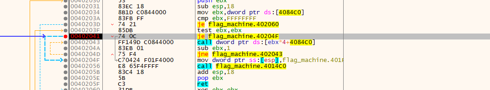

只要进入这个0x111，114514的分支就能拿到flag了
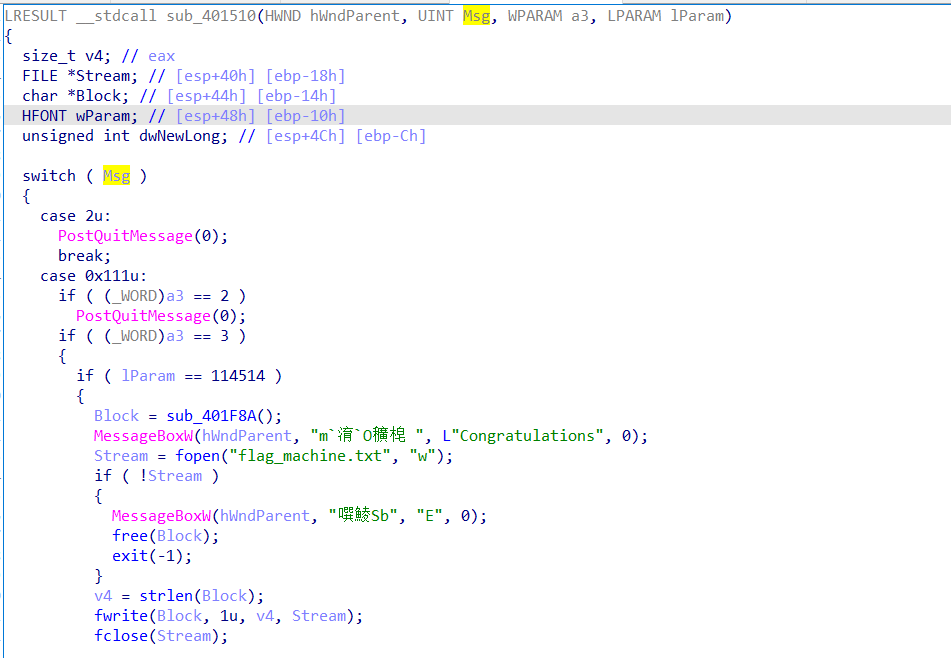

注意看0x1BF52，容易看出这就是十六进制的114514，做一个比较然后做一个跳转，前面有一个jmp跳转到生成窗口的地方，set eip跳过它，然后改两次zf到生成flag文件的地方，继续执行就拿到flag了
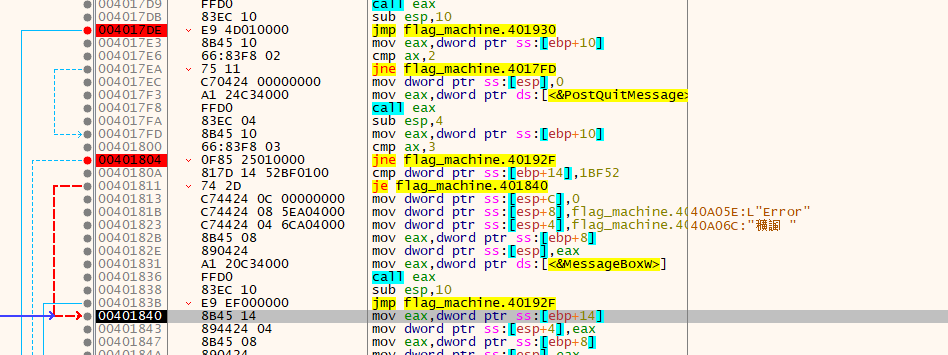

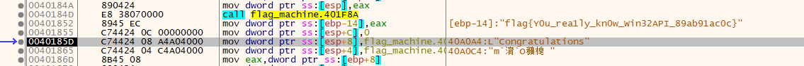

