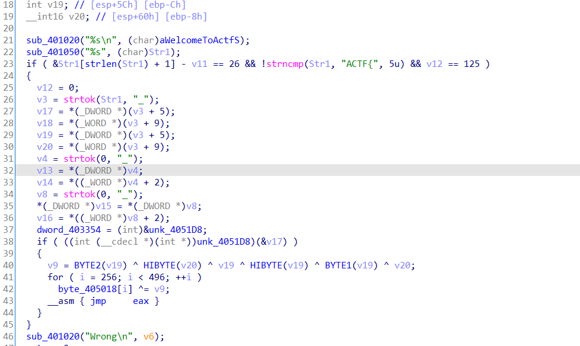

[smc(自修改)](https://baike.baidu.com/item/%E8%87%AA%E4%BF%AE%E6%94%B9%E4%BB%A3%E7%A0%81/1218702?fr=aladdin)

看一眼


首先做了一个格式合法性检验，然后用strtok沿`_`切片，第一次要第一个变量，后面不用加，会输出第一次调用得到的其它切边

然后是unk_4050D8实际上是一个函数，被混淆到还原不出来了，本来想继续静态看，后来还是放弃改用动调了

可以看到byte_405018+256那个地方应该也是函数，然而这个异或值居然是前六位的异或值，所以必须拿到前六位才好

动调过程中就看到有比对得到前六位：`yOu0y*`
继续动调得到后面一组，不知道哪里生成了一个table，我们选择直接复制粘贴，index是输入异或（0x83 + 循环数）

最后一组是直接用strcmp给出了

下面是脚本
```python
table = [
    246, 163,  91, 157, 224, 149, 152, 104, 140, 101,
    187, 118, 137, 212,   9, 253, 243,  92,  60,  76,
    54, 142,  77, 196, 128,  68, 214, 169,   1,  50,
    119,  41, 144, 188, 192, 168, 216, 249, 225,  29,
    228, 103, 125,  42,  44,  89, 158,  61, 122,  52,
    17,  67, 116, 209,  98,  96,   2,  75, 174, 153,
    87, 198, 115, 176,  51,  24,  43, 254, 185, 133,
    182, 217, 222, 123, 207,  79, 179, 213,   8, 124,
    10, 113,  18,   6,  55, 255, 127, 183,  70,  66,
    37, 201, 208,  80,  82, 206, 189, 108, 229, 111,
    165,  21, 237, 100, 240,  35,  53, 231,  12,  97,
    164, 215,  81, 117, 154, 242,  30, 235,  88, 241,
    148, 195,  47,  86, 247, 230, 134,  71, 251, 131,
    94, 204,  33,  74,  36,   7,  28, 138,  90,  23,
    27, 218, 236,  56,  14, 126, 180,  72, 136, 244,
    184,  39, 145,   0,  19, 151, 190,  83, 194, 232,
    234,  26, 233,  45,  20,  11, 191, 181,  64, 121,
    210,  62,  25,  93, 248, 105,  57,  95, 219, 250,
    178, 139, 110, 162, 223,  22, 226,  99, 177,  32,
    203, 186, 238, 141, 170, 200, 199, 197,   5, 102,
    109,  58,  69, 114,  13, 202, 132,  78, 245,  49,
    107, 146, 220, 221, 156,  63,  85, 150, 161, 159,
    205, 155, 227, 160, 167, 252, 193, 120,  16,  46,
    130, 143,  48,  84,   4, 172,  65, 147, 211,  59,
    239,   3, 129, 112, 166,  31,  34,  38,  40, 106,
    171, 135, 173,  73,  15, 175
]

key = [0x30, 4, 4, 3, 0x30, 0x63]

flag1 = 'yOu0y*'
flag2 = ''
flag3 = '5mcsM<'

for i in range(6):
    _ = table.index(key[i])
    flag2 += chr(_ ^ (i + 0x83))

flag = "flag{" + flag1 + '_' + flag2 + '_' + flag3 + "}"
print(flag)

#flag{yOu0y*_knowo3_5mcsM<}
```

这里有静态的分析：[BUU-Splendid_MineCraft - Papayo - 博客园 (cnblogs.com)](https://www.cnblogs.com/lxy8584099/p/13711408.html)