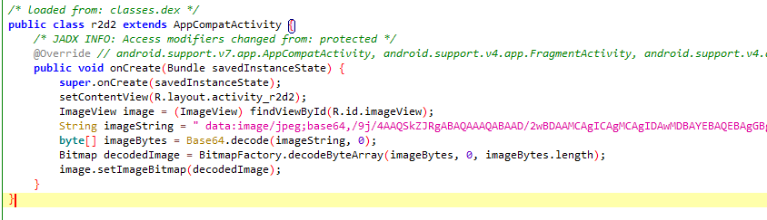

如图，很简单，把字符变成图片

<br>
脚本是这样：
```python
from base64 import b64decode

with open('data.txt', 'r') as f:
    data = f.read()

flag = b64decode(data.encode())

with open("flag.jpg", 'wb') as f:
    f.write(flag)
```

解出来之后是这样：
