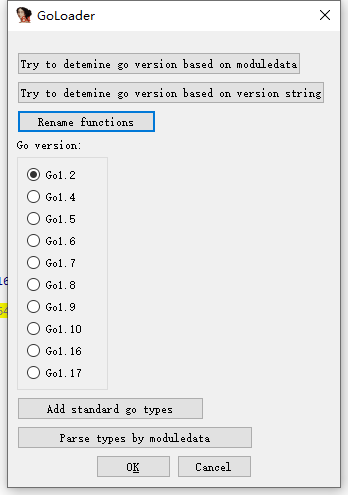
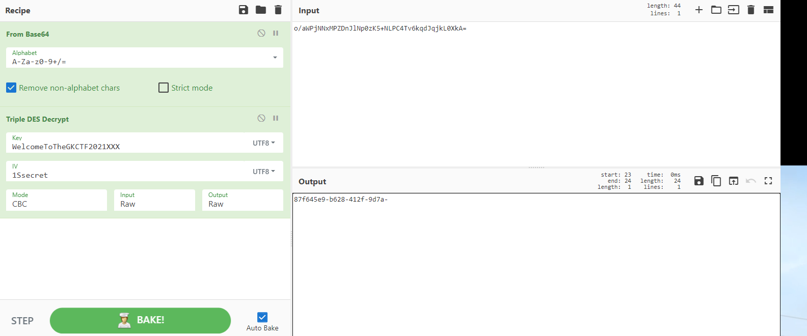

开始并没有注意到这是go题，瞄了一眼wp才看出来

用golanghelper跑出来的内容差强人意
同时它正常的使用顺序应该是

就大概挨个点一遍，事实上前面两个是确定版本用的
跑出来甚至伪代码里关键逻辑会缺失，有空的话还是要换上高版本IDA

讲一下逻辑，除开flag壳子的话，前面24位是用3DES加解密的

cyberchef提供了Triple DES解密，照这个来就好，通过原理来解的话，解不出，不知道原因
然后是注意先用base64给它还原出来

后面还有12位分4位一个块
第一个块是sha256
第二个块是sha512
第三个块是md5
用穷举解即可

下面是exp
```python
from hashlib import *


sha256_code = '6e2b55c78937d63490b4b26ab3ac3cb54df4c5ca7d60012c13d2d1234a732b74'
sha512_code = '6500fe72abcab63d87f213d2218b0ee086a1828188439ca485a1a40968fd272865d5ca4d5ef5a651270a52ff952d955c9b757caae1ecce804582ae78f87fa3c9'
md5_code = 'ff6e2fd78aca4736037258f0ede4ecf0'

table = '1234567890abcdef'

for i1 in table:
    for i2 in table:
        for i3 in table:
            for i4 in table:
                s = i1 + i2 + i3 + i4
                tmp = sha256(s.encode()).hexdigest()
                if tmp == sha256_code:
                    print(s, end = '')

for i1 in table:
    for i2 in table:
        for i3 in table:
            for i4 in table:
                s = i1 + i2 + i3 + i4
                tmp = sha512(s.encode()).hexdigest()
                if tmp == sha512_code:
                    print(s, end = '')

for i1 in table:
    for i2 in table:
        for i3 in table:
            for i4 in table:
                s = i1 + i2 + i3 + i4
                tmp = md5(s.encode()).hexdigest()
                if tmp == md5_code:
                    print(s, end = '')
# e402f20af940
```
这个题的flag罕见的包的原来的壳子

然后如果用golanghelper跑出来的话，我们看不到最后的MD5的部分，很伤


