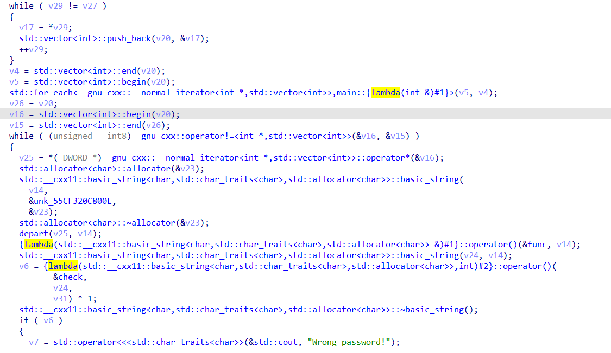
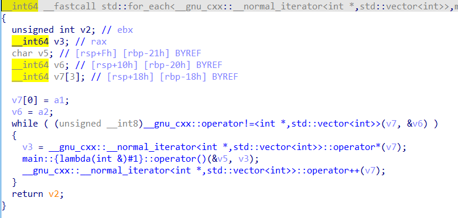
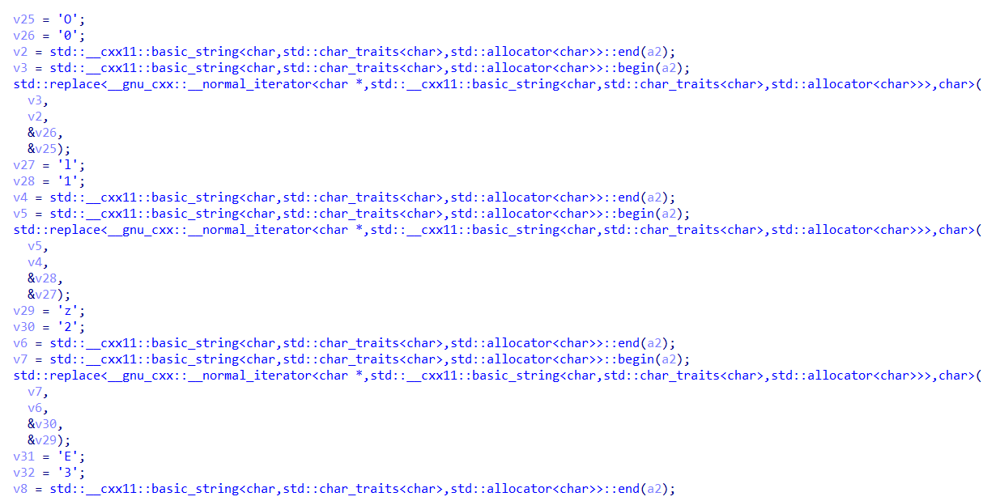
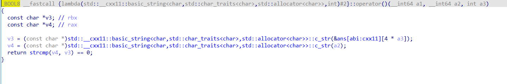
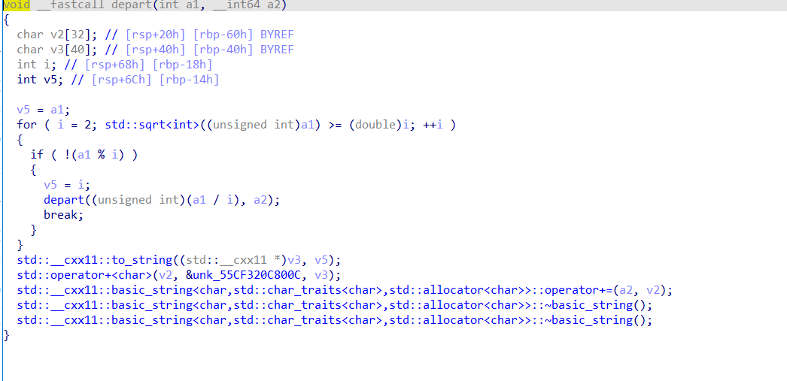
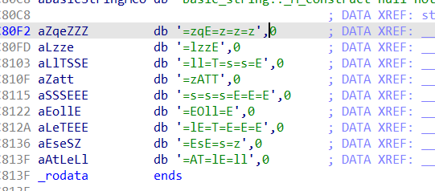

部分逻辑如下：


事实上，对于C++的逆向，看类名和方法名（不知道是不是叫这个）来分析是比较靠谱的，因为C++中的类本质是结构体，比较复杂，用动调跟的话也是一头雾水

这里其他都是基本操作，只有depart和三个匿名函数是值得研究的

第一个里边嵌套了一个匿名函数，只是简单地进行了异或1


第二个是进行了一些替换，第一次见到这么系统的数字换字母


第三个即为check


depart函如其名，是进行了分解，需要一丢丢代数学基础知识，能看出来这是一个质因数分解

然后就理清了加密逻辑，然后找到如下密文，在初始化的时候就进行了赋值


下面是解题脚本：
```python
import hashlib

cipher = '=zqE=z=z=z=lzzE=ll=T=s=s=E=zATT=s=s=s=E=E=E=EOll=E=lE=T=E=E=E=EsE=s=z=AT=lE=ll'

def replace_cipher(cipher):
    cipher = cipher.replace("O", "0")
    cipher = cipher.replace("l", "1")
    cipher = cipher.replace("z", "2")
    cipher = cipher.replace("E", "3")
    cipher = cipher.replace("A", "4")
    cipher = cipher.replace("s", "5")
    cipher = cipher.replace("G", "6")
    cipher = cipher.replace("T", "7")
    cipher = cipher.replace("B", "8")
    cipher = cipher.replace("q", "9")
    cipher = cipher.replace("=", " ")
    return cipher

cipher = replace_cipher(cipher)
print(cipher.split(" "))

# ['', '293', '2', '2', '21223', '11', '7', '5', '5', '3', '2477', '5', '5', '5', '3', '3', '3', '3011', '3', '13', '7', '3', '3', '3', '353', '5', '2', '47', '13', '11']

big_nums = [293 * 2 * 2 * 2, 1223, 11 * 7 * 5 * 5 * 3, 2477, 5 * 5 * 5 * 3 * 3 * 3, 3011 * 3, 13 * 7 * 3 * 3 * 3, 353 * 5 * 2, 47 * 13 * 11]
flag = 'FLAG{'
d = ''
for i in range(len(big_nums)): 
    big_nums[i] ^= 1
    d += str(big_nums[i])
flag += hashlib.md5(d.encode()).hexdigest() + '}'
print(flag.swapcase())

#flag{4367FB5F42C6E46B2AF79BF409FB84D3}

```
注意最后是32位大写的md5